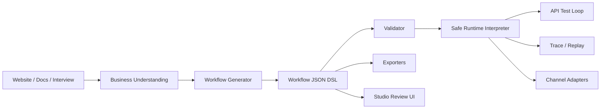

# 03 Target Architecture

## Future Structure

- `apps/api`: validation, runtime test loop, persistence, channel webhooks later.
- `apps/studio`: review/edit/test UI later.
- `packages/workflow-dsl`: types, schema, validator, migrations.
- `packages/runtime-core`: safe interpreter, state, trace.
- `packages/business-understanding`: website/docs/interview extraction later.
- `packages/workflow-generator`: business understanding to workflow draft later.
- `packages/rag`: ingestion, chunking, retrieval, citations later.
- `packages/channel-adapters`: Telegram first, WhatsApp/web later.
- `packages/exporters`: Native JSON, Mermaid, React Flow, Leap Draft, CRM formats.
- `packages/testing`: workflow fixtures, simulations, regression tests later.

Implementation may start simpler, but boundaries must stay clean.

