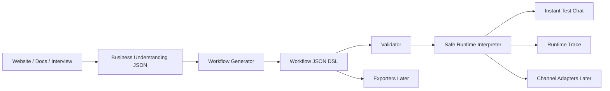

# Architecture

## Package Boundaries

- `packages/workflow-dsl`: workflow types, safe condition AST, validator, examples.
- `packages/runtime-core`: safe interpreter, session state, trace, channel-neutral outputs.
- `packages/shared`: shared primitives that do not belong to product domains.
- `packages/business-understanding`: future website/document/interview understanding interfaces.
- `packages/workflow-generator`: future conversion from business understanding to workflow JSON.
- `packages/channel-adapters`: future Telegram, WhatsApp, web widget adapters.
- `packages/exporters`: future Leap/CRM/workflow platform exports.
- `apps/api`: NestJS API boundary around validation and runtime test sessions.
- `apps/studio`: future frontend app placeholder.

## Why Greenfield

The old backend proves product intent, but it mixes runtime, generation, channels, and risky dynamic execution. This project starts from strict JSON definitions and a safe interpreter.

## Why Runtime Before Generator

AI generation is only useful if the generated workflow can be validated, tested, traced, and safely executed. The runtime gives us the contract before adding crawling or model calls.

## Why Telegram Before WhatsApp

Telegram is faster for preview testing and avoids WhatsApp template, onboarding, token, and webhook friction. WhatsApp comes after the core runtime is stable.

## Why Crawling Later

Website crawling produces uncertain data. First we prove the workflow shape, validator, runtime, and trace with deterministic examples.

